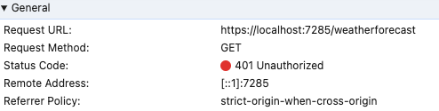

## Basic Api Gateway using DotNet, Yarp, Redis and Keycloak

This solution is an API Gateway implemented using YARP as a Reverse proxy, Keycloak as an Identity Provider, and Redis for session storage.
(You can find more details in this [artcile](https://medium.com/@ahmedmohamedelahmar/implement-api-gateway-with-token-handler-pattern-using-net-redis-and-keycloak-38250bfbd733))

### Solution structure

- ApiGateway project: a combination of a reverse proxy and OAuth2 Client. It maps incoming requests to the appropriate backend/micro-service and manage Authentication & Authorization.
- Resource Server project: as name implies, this project is a simple micros service to test  ApiGateway functionalities. It exposes endpoints protected by Keycloak.
- Infra folder: contains necessary files to setup solution infrastructure
    - docker-compose file to spin up keycloak, postgresql and redis containers
    - create-terraform-client script to create a service account for terraform in order to provision keycloak resources.
    - [main.tf](http://main.tf) to create keycloak realm, client and user.

### How to run
1. Setup infrastructure
  ```bash
  cd infra
  docker compose up -d
  chmod +x ./create-terraform-client.sh
  terraform init
  terraform appy
  ```
2. Run Api Gateway
  ```bash
  cd ../src/Gateway
  dotnet run
  ```
3. Run microservice (in another terminal)
  ```bash
  $ cd ../src/ResourceServer
  $ dotnet run
  ```
## Demo
You can check projects swaggers:
* Api Gateway: https://localhost:7140/swagger/index.html 
* Microservice: https://localhost:7140/swagger/index.html

When you hit the weather forecast endpoint directly from the microservice, you shall receive
a 401 unauthorized error.



When you hit it from the gateway using this url "https://localhost:7140/weatherforecast", you will be redirected
to Keycloak login page. The redirection is done automatically since the weather forecast is 
protected using an a custom authorization policy that requires an authenticated user.


(username: red, password: red)

After a successful login, the gateway shall create a cookie and an authorization ticket and remove Cookie header and replace it
with Authorization header with the corresponding access token as it's value before forwarding the http request
to the microservice.

**PS:** If you have RedisInsight running, you can check the created cookie content in Redis.


To end user's session, hit the **/account/logout** endpoint. You will be redirected to **https://localhost:7140/account/public**.